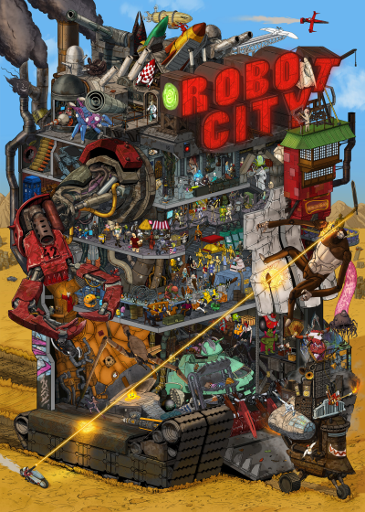
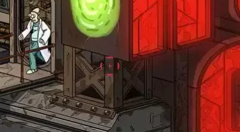
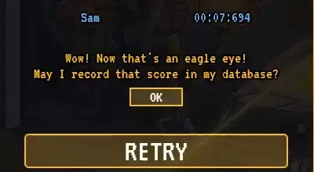
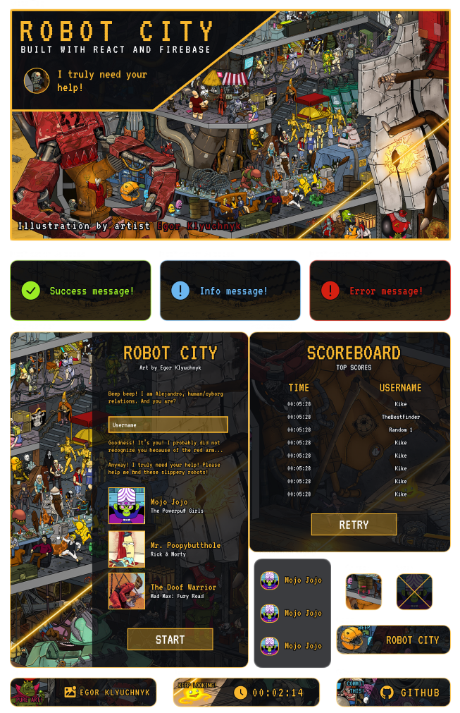

# Robot City

A photo tagging app made on _React_ & _Firebase_

**[Robot City (Live Preview)](https://alejandrovela-dev.github.io/robot-city/)**

Art by [Egor Klyuchnyk](https://chekavo.artstation.com/)

**[Technologies](#technologies) • [Features](#features) • [Design](#design) • [Credits](#credits) • [Contact](#contact)**

## Technologies

- [React](https://reactjs.org/) - A JavaScript library for building user interfaces.
- [Firebase](https://firebase.google.com/) - Backend development platform.
- [bad-words](https://www.npmjs.com/package/bad-words) - A JavaScript filter for badwords.
- [Figma](https://www.figma.com/) - Web-based graphics editing tool and UI design app.

## Features

### ☁️ Server-side checks for Robot locations

All the relevant procedures such as checking robot location/hitbox or player score comparisons are handled server side using _Firebase_.

### 📈 Global leaderboard

_Robot City_ gets realtime updates from _Cloud Firestore_. When a player scores high enough to be a new top record, it is asked if its score may be recorded. The data that is provided also functions as a source for comprobations to prevent duplicated names.

### ❗ Profanity filter for player names

Considering the fact that a top score can remain at the leaderboard for a long period of time, limiting some word or phrases might help keeping a healthy data. However, this featured is handled by [bad-words](https://www.npmjs.com/package/bad-words). Some additions to the blacklist or extra dictionaries may be recommended.

### 📱 Responsive design

Flexbox/grid layout and media-queries provide a satisfactory experience in small devices and landscape orientations. Robots locations are handled with relative coordinates and includes overflow edge-cases. Using `getBoundingClientRect()` allowed me to capture elements' position relative to the viewport for this cases.

## Design

### 🎨 UI Prototype designed on Figma

Based on my experience, prototyping allows a more straightforward implementation. Even though final status may defer from the original design in personal projects, it is definitely worth it in terms of time optimization. I don't consider myself a designer, but creating challenging interfaces is great way to ~~hate yourself~~ polish your CSS skills.

  

## Credits

Robot City was designed by illustrator and concept artist [Egor Klyuchnyk](https://chekavo.artstation.com/).

This project is an assignment from [TheOdinProject](https://www.theodinproject.com).

## Contact

Created by [@AlejandroVela](alejandroveladev@gmail.com) - feel free to contact me!
